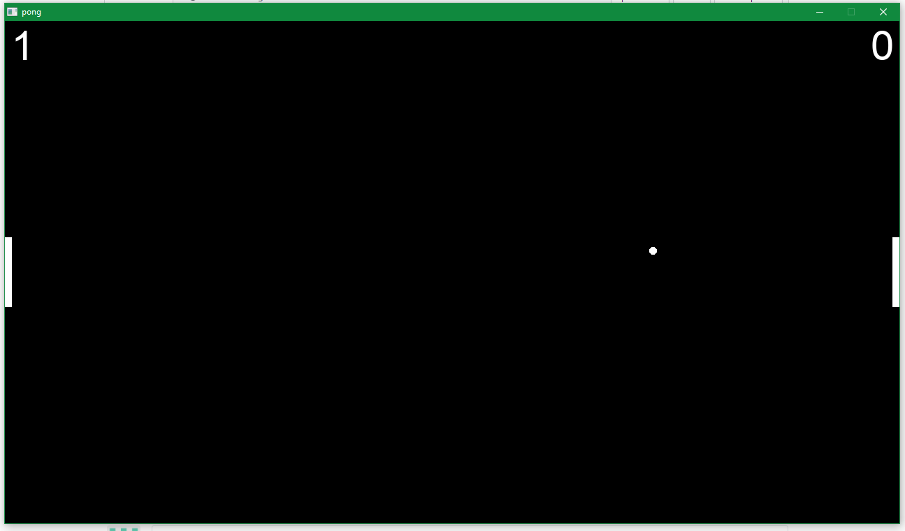

# SDL2pong
A clone of pong created using SDL2. The game utilize many tools provided by SDL2 such as image processing, text processing, and window creation.
A good thing about this game is that the main SDL2 implementation is pretty much reusable for any other game (with minor changes of course). The main logic of the game is implemented in the stage.c file. This file is kind of big so maybe we can refactor it somehow in the future. For now this is a very nice proof of concept.
# SDL2 on Windows
There are many problems with developing C programs on Windows without Code::Block or VS Studio. For once, the VS compiler is not up to speed with the newest C standard (not that it matter anyways). But if you loves C and would like to do serious stuff on Windows with it, you will more than likely (as a newbie) be better off learning GCC and mingw. It took me a long time to figure out how to compile my code on Windows. The makefile of this project can be reused for anybody who would like to develop games using SDL2 on Windows. It maybe a little bit messy but it works.

A very easy two player game.
## Special thank to:
* [Parallel Realities](https://www.parallelrealities.co.uk/about/) for their awesome [SDL2 tutorials](https://www.parallelrealities.co.uk/tutorials/#shooter) using C.
* [Gigi's Lab](http://gigi.nullneuron.net/gigilabs/) for their awesome [SDL2_ttf tutorial](http://gigi.nullneuron.net/gigilabs/displaying-text-in-sdl2-with-sdl_ttf/).
